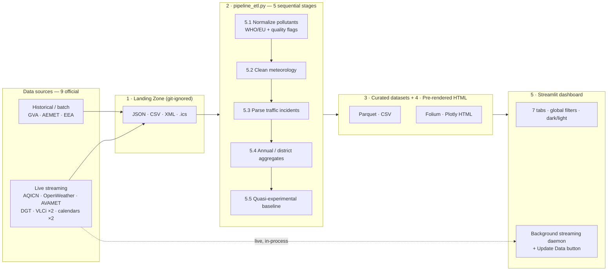
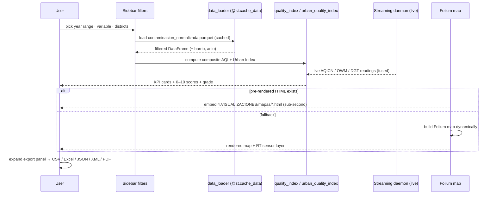

# Data Detective Valencia 🔍

> **How much do mass events actually move a city's air?**
> An end-to-end Big Data platform that fuses 70+ years of environmental archives with live sensor streams to measure — quasi-experimentally — the real impact of Fallas, concerts and citywide festivities on Valencia's air quality and traffic.

<p align="center">
  <a href="https://github.com/joan-oliver/Data_Detective/actions/workflows/ci.yml"></a>
  
  
  
  
  
  
  
  
  
  
  
  
</p>

<p align="center">
  
</p>

---

## Why this project

Most air-quality dashboards plot a pollutant over time and stop there. The interesting question is causal: *does a 19-day festival like Fallas actually raise NO₂, or is it just a busy spring week that would have looked the same anyway?* Answering it honestly means controlling for season, weekday and weather before you compare anything.

Data Detective does exactly that. It builds a **quasi-experimental baseline** for every event and reports the deviation as a single, interpretable percentage:

$$
\Delta\% = \frac{\bar{x}_{\text{event}} - \bar{x}_{\text{baseline}}}{\bar{x}_{\text{baseline}}} \times 100
$$

| Symbol | Meaning |
|---|---|
| $\bar{x}_{\text{event}}$ | Mean pollutant / traffic level during the event window |
| $\bar{x}_{\text{baseline}}$ | Mean over *comparable* non-event days (same month, same weekday, dry, quality-checked) |
| $\Delta\%$ | Signed impact — positive ⇒ event worsened the metric |

On top of that, live sensor readings are fused into a single **Urban Quality Index (0–10)** per district, and a statistical model projects tomorrow's pollution from historical patterns corrected by interannual trend and real-time data.

The whole thing runs self-contained on a single Windows machine — from raw HTTP responses to polished, exportable visualizations, no cloud required.

---

## Highlights

- **Quasi-experimental impact model** — every event is compared against a baseline of *comparable* days (same month + weekday, no event overlap, precipitation ≤ 5 mm, quality-flagged), not against the calendar mean. Season, weekly rhythm and weather confounds are controlled before the Δ% is computed.
- **70 years of data, two velocities** — meteorology from **1956**, air quality from **1963**, joined with live streams captured today. Historical batch + real-time streaming share one normalized schema.
- **Two synthetic indices, fully derived from code** — a weighted **Air Quality Index** over six pollutants against WHO thresholds, and a three-axis **Urban Quality Index** (pollution 50 % · weather 25 % · traffic 25 %) with automatic weight redistribution when a source is missing.
- **Background streaming daemon** — a daemon thread captures live data from **8 ingestion modules** while the dashboard serves the UI; a sidebar **Update Data** button triggers an on-demand cycle with thread-safe locking and cache invalidation. No separate process to babysit.
- **19 official districts, not 6 stations** — real-time AQICN readings are interpolated (proximity-weighted) from the GVA station network onto all 19 administrative districts, powering a live league table and dual WHO-threshold alerting.
- **Performance-engineered Streamlit** — columnar Parquet for the 121K-row pollution set, multi-tier `@st.cache_data` TTLs, `@st.fragment`-scoped reruns, and pre-rendered HTML maps/charts for sub-second tab switching.
- **Export everything** — every tab ships a CSV / Excel / JSON / XML / PDF export panel over the *currently filtered* slice (UTF-8 BOM, `;` separator), with formula-injection sanitization on the spreadsheet formats.
- **Hardened by default** — CSV/Excel formula-injection guards, HTML escaping of untrusted API strings (XSS), XSRF on and telemetry off via `.streamlit/config.toml`, secrets only in a git-ignored `.env`. CI runs `ruff` + `black` + `mypy` + `pytest` (90% coverage) on every push.

---

## Screenshots

> Run `streamlit run 5.DASHBOARD/app.py`, capture each tab and drop the PNGs into `docs/screenshots/` with these exact names:
> `tab_contaminacion.png` · `tab_eventos.png` · `tab_ranking.png` · `tab_comparador.png` · `tab_precipitaciones.png` · `tab_pronostico.png`
> (see [`docs/screenshots/README.md`](docs/screenshots/README.md)).

<table>
  <tr>
    <td width="50%" align="center"><strong>Air Quality — index, map & ranking</strong><br/>
      
    </td>
    <td width="50%" align="center"><strong>Mass Event Impact</strong><br/>
      
    </td>
  </tr>
  <tr>
    <td width="50%" align="center"><strong>District ranking & WHO alerts</strong><br/>
      
    </td>
    <td width="50%" align="center"><strong>Historical comparator</strong><br/>
      
    </td>
  </tr>
</table>

<details>
<summary><b>🌦️ Precipitation, traffic & forecast</b></summary>
<br/>
<table>
  <tr>
    <td align="center"><br/><sub>Precipitation + climatology</sub></td>
    <td align="center"><br/><sub>72h weather + statistical next-day</sub></td>
  </tr>
</table>
</details>

---

## Architecture

A unidirectional, file-mediated data stream. Each stage writes an immutable artifact consumed by the next; a failure is isolated to its stage and never propagates downstream without an explicit, idempotent re-run.



Request flow for the core view — `Air Quality` tab — showing the pre-rendered-first, dynamic-fallback strategy:



<details>
<summary><b>📁 Repository layout</b></summary>

```
DATA_DETECTIVE/                       ← project root (holds .env marker)
├── 1.DATOS_EN_CRUDO/                 Landing zone (git-ignored)
│   ├── historicos/                     GVA · AEMET · EEA — CSV / Parquet
│   ├── dinamicos/                      AQICN · OpenWeather · AVAMET · DGT — JSON / XML
│   └── eventos/                        .ics feeds + classified events
├── 2.SCRIPTS/
│   ├── recopilacion/                 16 scripts: API clients, scrapers, .ics parsers
│   │   ├── streaming_master.py            orchestrates the 8 live ingestion modules
│   │   ├── streaming_aqicn.py             real-time air quality (AQICN / WAQI)
│   │   ├── streaming_openweather.py       weather + 72h forecast (OpenWeatherMap)
│   │   ├── scraping_avamet.py             precipitation scraping (AVAMET)
│   │   ├── streaming_dgt.py               national traffic (DGT DATEX II v3.6)
│   │   ├── streaming_vlci_contaminacion.py  municipal air quality (VLCi)
│   │   ├── streaming_vlci_trafico.py        municipal traffic loops (VLCi)
│   │   ├── eventos_*.py                   event calendar scrapers
│   │   └── descargar_*_historico.py       historical batch downloaders
│   └── procesamiento/                ETL + visualization generation
│       ├── pipeline_etl.py            orchestrates 5.1 → 5.5
│       ├── normalizar_contaminacion.py  5.1 — WHO/EU normalization + quality flags
│       ├── limpiar_meteorologia.py      5.2 — meteorological cleaning
│       ├── limpiar_trafico.py           5.3 — traffic incident parsing
│       ├── calcular_estadisticas.py     5.4 — annual / district aggregations
│       ├── correlacion_eventos.py       5.5 — quasi-experimental baseline model
│       └── generar_*.py                 pre-rendered Folium / Plotly HTML
├── 3.DATOS_LIMPIOS/                  Curated datasets (git-ignored)
├── 4.VISUALIZACIONES/               Pre-generated HTML (git-ignored)
├── 5.DASHBOARD/                     Streamlit application
│   ├── app.py                        main orchestrator — 7 tabs, filters, CSS, fragments
│   ├── config.py                     paths, WHO/EU thresholds, 19 districts
│   ├── data_loader.py                cached loading layer (Parquet / CSV)
│   ├── streaming_background.py       daemon thread for live capture
│   ├── theme.py                      dark/light tokens (Plotly + Folium)
│   ├── components/                   sidebar, kpis, maps, ranking, alerts, tabs, export …
│   └── utils/
│       ├── quality_index.py          composite 0–10 air-quality engine
│       ├── urban_quality_index.py    3-axis urban fusion (pollution+weather+traffic)
│       ├── pronostico_estadistico.py statistical next-day pollution forecast
│       └── exportador.py             format converters (BOM, XML sanitization)
├── tests/                           test suite (123 tests, 90% coverage, offline)
├── utils/paths.py                   PROJECT_ROOT resolver (.env-anchored)
├── .env                             API keys (git-ignored)
├── requirements.txt · CLAUDE.md · README.md
```

</details>

---

## Tech stack & rationale

| Concern | Choice | Why |
|---|---|---|
| Language / OS | **Python 3.10+ on Windows 10/11** | Course constraint; everything is pathlib + UTF-8 to stay portable, no bash/cron assumptions |
| Dashboard | **Streamlit 1.54+** | Single-language UI, native caching, fragment reruns — no separate frontend stack to maintain |
| Storage | **pyarrow / Parquet** for pollution, **CSV** elsewhere | Columnar + compressed for the 121K-row hot dataset; CSV stays human-diffable for the small tables |
| Data processing | **pandas + numpy** | Whole pipeline is tabular aggregation; no Spark/Polars/Dask needed at this volume |
| Charts | **Plotly** | Interactive time-series / bar / radar, dark-theme native, exports to standalone HTML |
| Maps | **Folium + streamlit-folium** | Leaflet.js embedded in Streamlit; pre-rendered to HTML for speed, dynamic fallback for freshness |
| Live capture | **threading (stdlib)** | A daemon thread captures inside the Streamlit process — zero extra infra, survives reruns |
| Auto-refresh | **streamlit-autorefresh** | Polls the UI every 30 min so freshness indicators update without a manual reload |
| HTTP / APIs | **requests, aiohttp** | REST calls with retry + backoff; aiohttp where concurrency helps |
| Scraping | **BeautifulSoup4, lxml** | AVAMET network + event calendars have no API |
| Calendars | **icalendar, icalevents** | Parse the `.ics` event feeds into typed records |
| Excel export | **openpyxl** | Native `.xlsx` via `pandas.ExcelWriter`, preserves types regardless of locale |
| PDF export | **fpdf2** | Formatted tables with header + metadata, no headless browser dependency |
| Config / secrets | **python-dotenv** | API keys live only in `.env` (git-ignored); `.env` doubles as the PROJECT_ROOT marker |
| Scheduling | **schedule** | Windows-Task-Scheduler-friendly; explicitly *not* cron |
| Testing | **pytest** | Offline integration suite — mock DataFrames, `st.cache_data` patched |

---

## Features

### Indices & KPIs
- **Composite Air Quality Index (0–10)** — weighted score per station/district. For each pollutant: `ratio = mean / WHO_threshold`, `score = max(0, 10 − ratio·5)` (ratio 0 → 10, 1 → 5, 2 → 0); the global score is the weighted mean (`NO₂` 0.30, `PM2.5` 0.30, `PM10` 0.15, `O₃` 0.15, `SO₂` 0.05, `CO` 0.05), with absent-pollutant weights redistributed proportionally.
- **Urban Quality Index (0–10)** — three-axis fusion: pollution 50 %, meteorology 25 %, traffic 25 %. Meteorology blends temperature (ideal 18–25 °C), humidity (ideal 40–70 %) and rain sub-scores; traffic scores off live incident count + severity. Missing axes redistribute their weight automatically.
- **Neighborhood ranking** — dynamic league table over all 19 districts with the urban fusion score, medal icons, worst-pollutant identification and a progress column.

### Real-time & alerting
- **Background streaming & on-demand refresh** — daemon captures from 8 modules (AQICN, OpenWeatherMap, AVAMET, DGT DATEX II, two VLCi municipal feeds, two event calendars); the **🔄 Update Data** sidebar button triggers a manual cycle with thread-safe locking and cache invalidation.
- **Dual contamination alerts** — historical alerts scan the most recent 30 days against WHO thresholds; live alerts fire when any district currently exceeds WHO limits.
- **Interactive sensor map** — Folium with live AQICN + OpenWeather popups, district heatmap overlay, per-station markers colour-coded by pollution ratio, and the Turia Garden polyline as a green reference corridor.
- **Clean-air walking routes** — five predefined low-pollution routes with real-time AQI colour overlay per segment.

### Analysis & forecast
- **Mass event impact** — Gantt-style timeline + grouped bars quantifying NO₂, PM10, PM2.5 and traffic Δ% during Fallas, civic celebrations, concerts and other classified events.
- **Historical comparator + Pattern Detective** — triple mode: *Event vs. Baseline* (bars), *Period vs. Period* (radar), and *Pattern Detective* anomaly detection over arbitrary date ranges.
- **Dual forecast** — a 72-hour weather-based risk forecast (atmospheric washout heuristic) plus a statistical next-day pollution forecast (see [Methodology](#methodology)).

### UX & export
- **Dark / light theme** — coherent tokens across Plotly, Folium and inline HTML, persisted in session state.
- **Multi-format export** — every tab exports the filtered slice as CSV (`;`, UTF-8 BOM), Excel (`.xlsx`, native types), JSON (metadata envelope), XML (sanitized element names) or PDF. Spreadsheet formats are sanitized against formula injection.

---

## Methodology

### 1 · Event impact — quasi-experimental baseline

Implemented in [`correlacion_eventos.py`](2.SCRIPTS/procesamiento/correlacion_eventos.py). The point of the design is to make the comparison group resemble the event days in everything *except* the event itself.

```
1. DEFINE event window  →  [start_date, end_date]

2. BUILD baseline from "comparable days" satisfying ALL of:
     ✓ Same calendar month        (seasonal control)
     ✓ Same day-of-week           (weekly-rhythm control)
     ✓ No overlap with ANY event  (cross-contamination prevention)
     ✓ Precipitation ≤ 5 mm       (weather-confound control)
     ✓ calidad_dato == "ok"       (measurement validity)

3. COMPUTE per pollutant and for traffic:
     Δ% = ((mean_event − mean_baseline) / mean_baseline) × 100

4. RECORD temperature & precipitation for both windows
     as descriptive controls (transparency, not regression)
```

The output ([`impacto_eventos.csv`](3.DATOS_LIMPIOS)) carries one row per *event × pollutant*, plus the traffic Δ% and the meteorological controls — enabling questions like *"do prolonged high-impact events like Fallas sustain NO₂ increases, while short concerts only spike traffic that fades within hours?"*

> **Honesty note.** This is a *quasi*-experiment, not a randomized one. The meteorological columns are stored as descriptive controls, not as regression covariates — the design controls for weather by *exclusion* (dry days only) and for season/weekday by *matching*, and is transparent about the residual confounds it does not model.

### 2 · Statistical next-day forecast

Implemented in [`pronostico_estadistico.py`](5.DASHBOARD/utils/pronostico_estadistico.py). For each of NO₂, O₃, PM10, PM2.5:

| Step | Rule |
|---|---|
| **Stratify** | Filter history to the *same month + weekday* as the target day; fall back to month-only when scarce |
| **Confidence** | `Alta` ≥ 50 matching records · `Media` ≥ 10 · `Baja` otherwise (month-only fallback) |
| **Central estimate** | Historical mean, with P25–P75 as the published range |
| **Trend correction** | Compare the last 3 years' monthly mean vs. earlier years; multiply by `factor = clip(ratio, 0.5, 1.5)` to avoid extreme extrapolation |
| **Real-time fusion** | When live AQICN data exists: `prediction = 0.60 · historical + 0.40 · real_time` |

This deliberately stays interpretable — every number on the forecast card traces back to a record count, a trend ratio and a fusion weight, not a black box.

---

## Data sources

| Source | Type | Variables | Period |
|---|---|---|---|
| **GVA** — Generalitat Valenciana | REST API | NO₂, O₃, PM10, PM2.5, SO₂, CO | 1963 – present |
| **AEMET** OpenData | REST API | Temperature, humidity, precipitation | 1956 – present |
| **European Environment Agency** | Bulk download | EU-wide air-quality records | Multi-decade |
| **AQICN / WAQI** | REST API | Real-time AQI (6 stations) | Live |
| **OpenWeatherMap** | REST API | Current weather + 72h forecast | Live |
| **AVAMET** | Web scraping | Precipitation, temperature (Valencia network) | Live |
| **DGT** — Dirección General de Tráfico | DATEX II v3.6 XML | Traffic intensity, speed, incidents | Live |
| **VLCi** — Valencia City Council | Municipal Open-Data API | Municipal air quality + traffic loops | Live |
| **Visit Valencia / City Council** | `.ics` + scraping | Mass-events calendar | Current season |

<details>
<summary><b>📍 GVA monitoring stations (Valencia city)</b></summary>

| Station ID | Location | District |
|---|---|---|
| 46250001 | Avd. Francia / Pista de Silla | Quatre Carreres |
| 46250004 | Viveros | Jesús |
| 46250030 | Molí del Sol | Jesús |
| 46250047 | Politècnic | Benimaclet |
| 46250050 | Molí del Sol (zona Patraix) | Patraix |
| 46250054 | Centre | Ciutat Vella |

Real-time AQICN data is interpolated (proximity-weighted) from these stations onto all **19 official districts** (Ciutat Vella, L'Eixample, Extramurs, Campanar, La Saïdia, El Pla del Real, L'Olivereta, Patraix, Jesús, Quatre Carreres, Poblats Marítims, Camins al Grau, Algirós, Benimaclet, Rascanya, Benicalap, Pobles del Nord, Pobles de l'Oest, Pobles del Sud) when a direct reading is unavailable.

</details>

---

## Getting started

### Prerequisites

- **Python 3.10+** on Windows 10/11
- Free API keys (no credit card):
  - [AEMET OpenData](https://opendata.aemet.es/centrodedescargas/altaUsuario) — historical meteorology
  - [OpenWeatherMap](https://openweathermap.org/api) — 72h forecast (1,000 calls/day free)
  - [AQICN / WAQI](https://aqicn.org/data-platform/token/) — real-time AQI

### Install

```powershell
git clone https://github.com/joan-oliver/Data_Detective.git
cd Data_Detective

python -m venv env_data_detective
.\env_data_detective\Scripts\Activate.ps1

pip install -r requirements.txt
# Optional — linting/format/test tooling for contributors:
# pip install -r requirements-dev.txt
```

> `requirements.txt` lists the direct dependencies; pip resolves the rest. For a byte-for-byte reproducible environment, use the pinned lock `requirements-full.txt` instead.

### Configure

Copy the template and fill in your free API keys (`.env` is git-ignored):

```powershell
copy .env.example .env   # then edit .env
```

```ini
# .env — never commit this file
AQI_TOKEN=your_aqicn_token_here
OPENWEATHER_API_KEY=your_openweathermap_key_here
AEMET_API_KEY=your_aemet_key_here
```

### Run the pipeline

```powershell
# 1 — Seed initial live data (run once before first launch)
python 2.SCRIPTS/recopilacion/streaming_master.py

# 2 — Full ETL: normalize → clean → aggregate → correlate
python 2.SCRIPTS/procesamiento/pipeline_etl.py

# 3 — Pre-render maps & charts
python 2.SCRIPTS/procesamiento/generar_mapas.py
python 2.SCRIPTS/procesamiento/generar_graficos.py
python 2.SCRIPTS/procesamiento/generar_visualizaciones_eventos.py
python 2.SCRIPTS/procesamiento/generar_pronostico.py

# 4 — Launch the dashboard
streamlit run 5.DASHBOARD/app.py
```

Open `http://localhost:8501`.

> The dashboard auto-starts a background thread that captures from all 8 ingestion modules while the UI runs. You can also trigger a refresh from the **🔄 Update Data** sidebar button. Step 1 only seeds data before the first launch.

<details>
<summary><b>⏰ Automate capture with Windows Task Scheduler</b></summary>

To capture live data every 10 minutes without keeping a terminal open:

1. **Task Scheduler** → *Create Basic Task*
2. **Program/script**: `C:\...\env_data_detective\Scripts\python.exe`
3. **Add arguments**: `2.SCRIPTS\recopilacion\streaming_master.py`
4. **Start in** *(mandatory)*: `C:\...\Data_Detective\`
5. **Trigger**: repeat every 10 minutes, indefinitely

</details>

---

## Testing & quality

An integration suite validates core dashboard logic with **zero data files and zero network** — mock DataFrames, `st.cache_data` patched in `conftest.py`.

```powershell
pip install -r requirements-dev.txt   # ruff, black, pytest, pytest-cov

ruff check  "5.DASHBOARD" "2.SCRIPTS" "utils" "tests"   # lint
black --check "5.DASHBOARD" "2.SCRIPTS" "utils" "tests" # format
mypy utils                                              # type check (logic layer)
pytest --cov --cov-report=term-missing                  # 123 tests, ~90% coverage
```

Covered:
- Composite air-quality index and 3-axis urban index (0–10 scale, grade labels, weight redistribution, edge cases)
- Statistical next-day forecast (stratification, confidence tiers, trend factor, RT fusion, fallbacks)
- Quasi-experimental baseline (date parsing, event dedup, baseline mask: month/weekday/event/rain controls)
- Export layer — CSV/Excel formula-injection sanitization, XLSX/PDF integrity, XML/JSON
- HTML escaping of untrusted external strings (XSS hardening)
- Data-loader functions and configuration integrity (WHO/EU thresholds, station maps, 19 districts)

Every push runs **GitHub Actions CI** (`ruff` + `black --check` + `mypy` + `pytest --cov`, gate **85%**) on Python 3.11 and 3.12. `mypy` type-checks the pure-logic layer (`utils/`). Style, types, coverage and config all live in `pyproject.toml`; a coverage gate fails the build below threshold. Every source file is UTF-8 with Google-style docstrings, type hints on public functions, and `logging` (never `print`) for diagnostics.

> Coverage targets the pure-logic layer (`utils/` + ETL baseline helpers) at ~90%; the Streamlit UI is validated separately via a headless smoke launch.

---

## Performance

A focused pass keeps Streamlit responsive on a single laptop. Each change preserves behaviour.

| Layer | Change | Why it matters |
|---|---|---|
| Storage | 121K-row pollution dataset in **columnar Parquet** | Compressed on disk, fast column reads vs. a 100 MB+ CSV scan |
| Caching | `@st.cache_data` with **tiered TTLs** (5 min live → 1 h static) | Repeated filter combinations return instantly; live data still refreshes |
| Reruns | `@st.fragment`-scoped reruns | A filter change re-renders one component, not the whole 7-tab page |
| Maps / charts | **Pre-rendered HTML** in `4.VISUALIZACIONES/`, dynamic Folium fallback | Sub-second tab switches; generation cost is paid once, offline |
| Indices | Absent-source **weight redistribution** | The dashboard never crashes on a missing feed — it degrades the score gracefully |

---

## Architectural decisions & trade-offs

Documented so a reviewer can audit the reasoning without reverse-engineering the code.

#### Quasi-experimental, not regression
Weather is controlled by **exclusion** (dry days only, ≤ 5 mm) and season/weekday by **matching**, rather than by fitting a regression with meteorological covariates. The trade-off: a matched-baseline Δ% is immediately interpretable to a non-technical reader and needs no model assumptions, at the cost of not *quantifying* the residual weather effect. The temperature/precipitation columns are persisted alongside every result so a future iteration can lift them into a proper regression without changing the data contract.

#### Pre-rendered HTML first, dynamic Folium fallback
Maps and charts are generated offline into `4.VISUALIZACIONES/` and embedded as static HTML; the dashboard only builds a Folium map dynamically when the artifact is missing. This buys sub-second tab switches at the cost of a generation step — acceptable because the underlying ETL already runs as a batch, so the maps are regenerated in the same pass.

#### In-process streaming daemon, not a separate service
Live capture runs as a daemon **thread inside the Streamlit process** rather than as an external worker or scheduled job. On a single-machine, single-user academic deployment this removes all inter-process plumbing and lets the sidebar **Update Data** button share the same cache namespace. The seam is clean: `streaming_master.py` is already a standalone entry point, so the exact same capture logic can be promoted to a Windows Task Scheduler job (documented above) for unattended operation.

#### Parquet for one dataset, CSV for the rest
Only the 121K-row pollution table justifies columnar storage; the smaller traffic/meteorology/event/stat tables stay CSV so they remain human-diffable in git history and trivially inspectable. Mixing formats is a deliberate fit-to-size choice, not an inconsistency.

---

## What I'd do next

- **CI** — GitHub Actions running `pytest` + `ruff` + `black --check` on push.
- **Forecast validation** — back-test the statistical next-day model on a chronological holdout and publish MAE per pollutant.
- **Regression layer** — promote the stored meteorological controls into a proper event-impact regression to quantify the residual weather effect the matched baseline only excludes.
- **Coverage** — extend the offline suite to the export converters and the urban-index axis fusion.
- **Deploy** — a read-only Streamlit Community Cloud demo seeded with a public sample of the curated datasets.

---

## Disclaimer

This is an **academic and analytical platform**. It does not provide official health recommendations or regulatory-grade assessments. WHO and EU thresholds are used for contextual comparison only. For official information consult [GVA Qualitat de l'Aire](https://agroambient.gva.es) and your local health authority.

---

## License

[MIT](LICENSE) — see the LICENSE file.

---

## Author

Built by **Joan V. Oliver Rosell** as a graduate Big Data portfolio project — data engineering, ETL design, quasi-experimental analysis and a performance-tuned Streamlit application.

[](https://www.linkedin.com/in/joan-v-oliver-rosell-84b260257)
[](mailto:joanoliverrosell@gmail.com)

<p align="center"><sub>Built with data — from Valencia 🇪🇸</sub></p>
